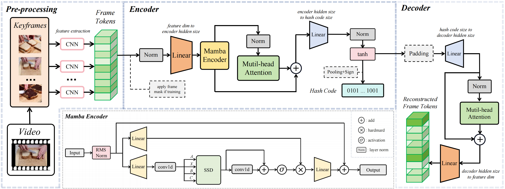
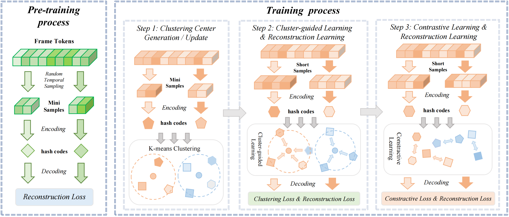

# WSCH: Wide-Shallow Autoencoder for Self-Supervised Video Hashing with Cyclic Multi-Task Learning






## Catalogue <br> 
* [1. Getting Started](#Getting-Started)
* [2. Training](#Training)
* [3. Testing](#Testing)
* [4. Trained Models](#Trained-Models)
* [5. Results](#Results)


## Getting Started

### 1. Clone Repository
```bash
git clone https://github.com/anon271/WSCH
cd WSCH
```

### 2. Environment Setup
```bash
conda create -n wsch python=3.10.13
conda activate wsch
conda install pytorch==2.1.1 pytorch-cuda=11.8 -c pytorch -c nvidia
pip install -r requirements.txt
```

### 3. Download Datasets
VGG features of FCVID and YFCC are kindly provided by the authors of [SSVH]. ResNet50 features of ActivityNet are provided by the authors of [BTH]. You can download these datasets from Baidu disk:

| Dataset | Link |
|---------|------|
| FCVID | [Baidu disk](https://pan.baidu.com/s/1v0qo4PtiZgFB9iLmj3sJIg?pwd=0000) |
| ActivityNet | [Baidu disk](https://pan.baidu.com/s/1cDJ0-6T2-AOeLgp5rBihfA?pwd=0000) |
| YFCC | [Baidu disk](https://pan.baidu.com/s/1jpqcRRFdiemGvlPpukxJ6Q?pwd=0000) |

### 4. Configure Dataset Paths
Modify the dataset paths in the corresponding JSON files:
- Json/Anet.json
- Json/fcvid.json
- Json/yfcc.json

## Training

### Training WSCH:

1. Modify parameters in `run.py`:
   - `data_set_config`: Path to dataset JSON file
   - `max_iter`: Number of epochs for pre-training and training
   - `result_log_dir`: Root directory for training logs
   - `result_weight_dir`: Root directory for model weights
   - `lr`: Learning rate
   - `batch_size`: Training batch size
   - `hidden_size`: Encoder hidden layer width
   - `decoder_size`: Decoder hidden layer width
   - `hashcode_size`: Hash code dimension
   - `weight_path`: Path to load trained model
   - `cfg`: Hyperparameters (see paper for details)

2. Run pre-training:
```bash
python run.py
```

3. For training:
   - Change `from pretrain import train_model` to `from train import train_model`
   - Update `weight_path` to pre-trained model weights directory
```bash
python run.py
```

## Testing

### Testing WSCH:

1. Modify `run.py`:
   - Change `from train import train_model` to `from test import train_model`
   - Update `weight_path` to trained model weights directory

2. Run testing:
```bash
python run.py
```

## Trained Models

Trained WSCH checkpoints are available for download from: [Baidu disk](https://pan.baidu.com/s/1qdCe6eZQR6ijhen_MbDbUg?pwd=mfok#list/path=%2F) .

## Results

For this repository, the expected performance is:

| *Dataset* | *Bits* | *mAP@5* | *mAP@20* | *mAP@40* | *mAP@60* | *mAP@80* | *mAP@100* |
| ---- | ---- | ---- | ---- | ---- | ---- | ---- | ---- |
| FCVID | 32 | 0.492 | 0.361 | 0.323 | 0.303 | 0.287 | 0.273 |
| FCVID | 64 | 0.558 | 0.424 | 0.384 | 0.362 | 0.345 | 0.328 |
| FCVID | 128 | 0.578 | 0.448 | 0.409 | 0.387 | 0.368 | 0.351 |
| Act-Net | 32 | 0.311 | 0.195 | 0.120 | 0.085 | 0.066 | 0.053 |
| Act-Net | 64 | 0.378 | 0.242 | 0.146 | 0.102 | 0.078 | 0.063 |
| Act-Net | 128 | 0.386 | 0.253 | 0.151 | 0.106 | 0.081 | 0.065 |
| YFCC | 32 | 0.176 | 0.103 | 0.086 | 0.079 | 0.076 | 0.073 | 
| YFCC | 64 | 0.187 | 0.108 | 0.090 | 0.083 | 0.080 | 0.077 |
| YFCC | 128 | 0.192 | 0.111 | 0.093 | 0.086 | 0.081 | 0.079 | 


[SSVH]:https://github.com/lixiangpengcs/Self-Supervised-Video-Hashing

[BTH]:https://github.com/Lily1994/BTH


